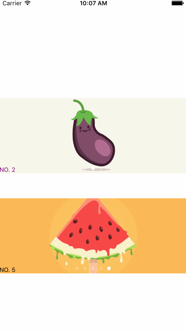

# LPCarouselView

Carousel auto scroll view with pageControl which is based on UICollectionView and http/https supports

# Usage
`needs one line code only!`
```swift
//load remote images
LPCarouselView *cv = [LPCarouselView carouselViewWithFrame:CGRectMake(0, 200, self.view.bounds.size.width, 150) placeholderImage:[UIImage imageNamed:@"carousel01"] images:^NSArray *{
        return @[
                 @"https://d13yacurqjgara.cloudfront.net/users/3460/screenshots/1667332/pickle.png",
                 @"https://d13yacurqjgara.cloudfront.net/users/610286/screenshots/2012918/eggplant.png",
                 @"https://d13yacurqjgara.cloudfront.net/users/514774/screenshots/1985501/ill_2-01.png",
                 ];
    } titles:^NSArray *{
        return @[@"NO. 1", @"NO. 2", @"NO. 3"];
    } selectedBlock:^(NSInteger index) {
        NSLog(@"clicked1----%zi", index);
    }];
    
//load local images
LPCarouselView *cv2 = [LPCarouselView carouselViewWithFrame:CGRectMake(0, 400, self.view.bounds.size.width, 150) placeholderImage:nil images:^NSArray *{
        return @[
                 @"carousel01.png",
                 @"carousel02.png",
                 @"carousel03.png",
                 @"carousel04.png",
                 @"carousel05.png",
                 ];
    } titles:^NSArray *{
        return @[@"NO. 1", @"NO. 2", @"NO. 3", @"NO. 4", @"NO. 5"];
    } selectedBlock:^(NSInteger index) {
        NSLog(@"clicked2----%zi", index);
    }];
```
`there are some properties for your configuration just follow the sample code`

# Install

- use cocoapods
```swift
pod 'LPCarouselView', '~> 1.2.1'
```
- manual import
```swift
just download lib folder and add into your project
```

# Screenshot



# Release notes

- 1.2.1

`image contentMode bugfix`

- 1.2

`add pageControl tintColor & infinite loop properties`

- 1.1

`scroll duration bugfix and add default duration`

- 1.0

`origin version.`
